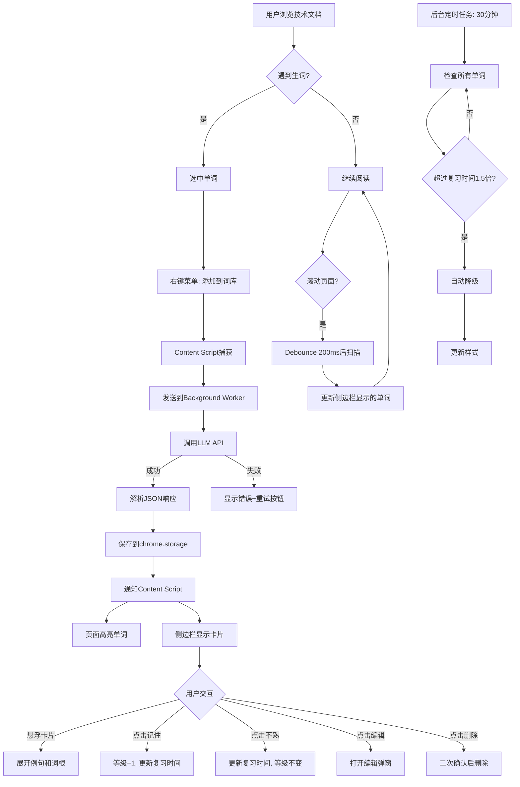

# 产品需求文档 (PRD) - Word Memo

## 📋 文档信息
- **产品名称**: Word Memo (词汇记忆助手)
- **版本**: V1.0
- **文档版本**: 1.0
- **创建日期**: 2026-01-05
- **目标平台**: Microsoft Edge 浏览器插件 (Manifest V3)

---

## 🎯 产品概述

### 产品定位
一款专为职场技术人员设计的**非侵入式英文阅读辅助与词汇记忆**浏览器插件，通过智能侧边栏和AI驱动的释义生成，在不干扰原文阅读的前提下，提供高效的词汇学习和记忆管理体验。

### 核心价值主张
- ✨ **非侵入式阅读**: 保持原文完整性，通过侧边栏辅助而非翻译覆盖
- 🎯 **主动式学习**: 用户自主选择生词，避免被动推送干扰
- 🧠 **科学记忆管理**: 基于遗忘曲线的多级记忆状态自适应系统
- 🤖 **AI智能释义**: LLM生成场景化释义，支持自定义编辑

### 目标用户
- **主要用户**: 职场技术人员（软件工程师、产品经理等）
- **使用场景**: 阅读英文技术文档、GitHub项目、技术博客、Stack Overflow等
- **核心痛点**:
  - 阅读被频繁查词打断，体验割裂
  - 重复遇到的生词记不住，每次都要查
  - 现有翻译插件过于侵入，破坏原文阅读流畅性

---

## 🏗️ 系统架构

### 技术栈
| 分类 | 技术选型 | 理由 |
|------|----------|------|
| **框架** | React 18 + TypeScript | 类型安全 + 组件化开发 |
| **构建工具** | Vite | 快速热更新，适合插件开发 |
| **状态管理** | Zustand | 轻量级，避免Redux复杂度 |
| **样式方案** | Tailwind CSS | 快速开发 + 主题切换 |
| **UI组件库** | Shadcn/ui | 高质量组件 + 可定制 |
| **插件API** | Chrome Extension API (Manifest V3) | Edge兼容 |
| **存储** | chrome.storage.local | 本地持久化 |
| **LLM集成** | OpenAI API 兼容接口 | 不绑定供应商，推荐gpt-3.5-turbo-0125 |
| **文本处理** | compromise.js | 词形还原（running→run） |
| **模糊搜索** | Fuse.js | 轻量级模糊匹配 |

### 插件架构组件
```
word-memo/
├── manifest.json              # Manifest V3配置
├── src/
│   ├── background/            # Service Worker
│   │   └── service-worker.ts  # 后台服务（API调用、存储管理）
│   ├── content/               # Content Script
│   │   ├── scanner.ts         # 页面扫描器（实时检测词库单词）
│   │   ├── highlighter.ts     # 单词高亮渲染
│   │   └── viewport-tracker.ts # 可视区域追踪
│   ├── sidepanel/             # 侧边栏UI
│   │   ├── App.tsx            # 主应用
│   │   ├── components/
│   │   │   ├── WordCard.tsx   # 单词卡片
│   │   │   ├── VocabBrowser.tsx # 词库浏览
│   │   │   └── Settings.tsx   # 设置页
│   │   └── hooks/
│   │       ├── useWordStore.ts # 词库状态管理
│   │       └── useLLM.ts      # LLM调用Hook
│   ├── lib/
│   │   ├── memory-algorithm.ts # 遗忘曲线算法
│   │   ├── llm-client.ts      # LLM API客户端
│   │   └── storage.ts         # 存储抽象层
│   └── types/
│       └── index.ts           # 全局类型定义
└── public/
    ├── icons/                 # 插件图标
    └── _locales/              # 国际化（可选）
```

---

## 📦 核心功能模块

### 1. 词汇管理系统

#### 1.1 添加单词到词库
**触发方式**: 用户在页面中选中单词 → 右键菜单 → "添加到词库"

**流程**:
1. 用户选中单词（如 "ephemeral"）
2. 右键菜单显示 "📚 添加到词库" 选项
3. 点击后触发LLM生成流程
4. 侧边栏显示Loading状态卡片
5. LLM返回后显示完整卡片
6. 页面中该单词立即高亮（红色波浪下划线）

**业务规则**:
- ✅ 单词去重：已存在词库中的单词不可重复添加
- ✅ 大小写不敏感：`Async` 和 `async` 视为同一单词
- ✅ 即时反馈：显示Toast提示 "正在添加..." → "添加成功"
- ❌ 暂不支持：批量添加、添加撤销

**错误处理**:
| 错误类型 | 提示信息 | 操作 |
|----------|----------|------|
| 单词已存在 | "该单词已在词库中" | 显示Toast 2秒 |
| 未选中单词 | "请先选中要添加的单词" | 右键菜单置灰 |
| LLM生成失败 | 见 [1.2 LLM集成] | 显示重试按钮 |

#### 1.2 LLM释义生成

**配置项**（用户在设置页配置）:
```typescript
interface LLMConfig {
  apiEndpoint: string;    // 默认: https://api.openai.com/v1/chat/completions
  apiKey: string;         // 用户自行配置
  model: string;          // 默认: gpt-3.5-turbo-0125（推荐）
  temperature: number;    // 默认: 0.3（稳定输出）
  timeout: number;        // 默认: 30000ms
}

/**
 * LLM服务商灵活性说明：
 * - 不绑定特定供应商，任何兼容OpenAI API格式的服务均可使用
 * - 支持：OpenAI、Azure OpenAI、国内大模型厂商（如智谱、百川、DeepSeek等）
 * - 推荐模型：gpt-3.5-turbo-0125（性价比最优，响应快）
 * - 用户可在设置页自由配置API端点和模型名称
 */
```

**Prompt模板**:
```typescript
const SYSTEM_PROMPT = `你是一个专业的英语词汇教学助手，专注于技术文档场景。请为给定单词生成结构化释义。`;

const USER_PROMPT = `
请为单词 "{word}" 生成以下内容，以JSON格式返回：

{
  "word": "单词原文（小写）",
  "phonetic": "英式音标（如 /ɪˈfem.ər.əl/）",
  "definitions": [
    {
      "pos": "词性（n./v./adj./adv.等）",
      "meaning": "中文释义（简洁，15字以内）"
    }
  ],
  "examples": [
    {
      "en": "英文例句（优先技术场景）",
      "zh": "中文翻译"
    }
  ],
  "etymology": "词根词缀解释（如：epi-在...之上 + hemer-日 + al-形容词后缀，意为'只持续一天的'）。如无明确词根，返回空字符串。"
}

要求：
1. definitions数组包含所有常见词性和释义（最多3个）
2. examples数组包含2-3个例句，优先使用编程/技术相关例句
3. 释义简洁专业，避免冗长解释
4. 例句难度适中，贴近实际使用场景
`;
```

**生成流程**:
```
1. 用户添加单词
2. Content Script → Background Service Worker
3. Service Worker调用LLM API（异步）
4. 超时30秒自动失败
5. 成功：解析JSON → 存储到chrome.storage.local
6. 失败：返回错误信息 → 显示重试按钮
```

**错误处理**:
| 错误类型 | UI展示 | 可操作 |
|----------|--------|--------|
| 网络错误 | "⚠️ 网络连接失败" | [重试] 按钮 |
| API Key无效 | "⚠️ API Key无效，请检查设置" | [去设置] 链接 |
| 请求超时 | "⚠️ 请求超时（30s）" | [重试] 按钮 |
| 响应格式错误 | "⚠️ 数据解析失败" | [重试] + [编辑] |
| 频率限制 | "⚠️ 请求过于频繁，请稍后再试" | 倒计时60s |

**成本估算**（以推荐模型 gpt-3.5-turbo-0125 为例）:
- 定价：$0.0005/1K input tokens，$0.0015/1K output tokens
- 预估单词释义消耗：~200 input + ~300 output tokens
- 单次生成成本：约 $0.0005/单词
- 1000个单词总成本：约 $0.5

**备注**：实际成本因服务商而异，用户可选择更经济的国内大模型服务（如DeepSeek、智谱等）

#### 1.3 编辑单词释义

**触发**: 单词卡片上的 ✏️ 编辑按钮

**编辑界面**（弹窗形式）:
```
┌─────────────────────────────────┐
│ 编辑单词: ephemeral        [×]  │
├─────────────────────────────────┤
│ 音标: /ɪˈfem.ər.əl/            │
│                                 │
│ 释义:                           │
│ ┌─────────────────────────────┐│
│ │ adj. 短暂的；瞬息的          ││
│ │ n. 短生植物                  ││
│ └─────────────────────────────┘│
│                                 │
│ 例句:                           │
│ ┌─────────────────────────────┐│
│ │ 1. Ephemeral storage lasts  ││
│ │    only during execution.   ││
│ │    临时存储仅在执行期间有效 ││
│ │                              ││
│ │ [+ 添加例句]                 ││
│ └─────────────────────────────┘│
│                                 │
│ 词根: epi-(在...之上) + hemer- │
│       (日) + al-(形容词后缀)   │
│                                 │
│        [取消]  [保存]           │
└─────────────────────────────────┘
```

**业务规则**:
- ✅ 所有字段可编辑
- ✅ 实时保存到本地存储
- ✅ 保存后卡片立即更新
- ❌ 无版本历史记录

#### 1.4 删除单词

**触发**: 单词卡片上的 🗑️ 删除按钮

**确认弹窗**:
```
确定删除单词 "ephemeral"？
该操作不可撤销。

学习数据：
- 添加时间: 2026-01-03
- 复习次数: 5次
- 当前状态: LEARNING

    [取消]  [确定删除]
```

**业务规则**:
- ✅ 二次确认防止误删
- ✅ 删除后页面高亮立即消失
- ✅ 侧边栏卡片淡出动画
- ❌ 无回收站/撤销功能

---

### 2. 记忆状态管理系统

#### 2.1 多级记忆模型

**状态定义**:
```typescript
enum MemoryLevel {
  NEW = 0,        // 新词（完全陌生）
  FAMILIAR = 1,   // 有印象（见过1-2次）
  LEARNING = 2,   // 学习中（见过3-5次）
  MASTERED = 3,   // 已掌握（见过6+次）
  ARCHIVED = 4    // 已归档（长期掌握，不再显示）
}

interface WordMemoryState {
  word: string;                  // 单词原文（小写）
  level: MemoryLevel;            // 当前记忆等级
  reviewCount: number;           // 总复习次数
  correctCount: number;          // 点击"记住"的次数
  lastReviewDate: Date;          // 上次复习时间
  nextReviewDate: Date;          // 下次复习时间（基于遗忘曲线）
  addedDate: Date;               // 添加到词库的时间
  lastSeenDate: Date;            // 最后一次在页面中出现的时间
}
```

#### 2.2 遗忘曲线算法

**核心算法**（基于SuperMemo SM-2简化版）:
```typescript
/**
 * 计算下次复习时间
 * @param currentLevel 当前记忆等级
 * @param isRemembered 用户是否点击"记住了"
 * @returns 下次复习的时间戳
 */
function calculateNextReview(
  currentLevel: MemoryLevel,
  isRemembered: boolean
): Date {
  // 复习间隔（天）
  const intervals: Record<MemoryLevel, { yes: number; no: number }> = {
    [MemoryLevel.NEW]:      { yes: 1,  no: 0.5 },  // 记住→1天后，不熟→12小时后
    [MemoryLevel.FAMILIAR]: { yes: 3,  no: 1 },    // 记住→3天后，不熟→1天后
    [MemoryLevel.LEARNING]: { yes: 7,  no: 3 },    // 记住→7天后，不熟→3天后
    [MemoryLevel.MASTERED]: { yes: 30, no: 7 },    // 记住→30天后，不熟→7天后
    [MemoryLevel.ARCHIVED]: { yes: 90, no: 30 },   // 记住→90天后，不熟→30天后
  };

  const days = isRemembered
    ? intervals[currentLevel].yes
    : intervals[currentLevel].no;

  return new Date(Date.now() + days * 24 * 60 * 60 * 1000);
}

/**
 * 升级记忆等级
 * @param currentLevel 当前等级
 * @returns 新等级
 */
function upgradeLevel(currentLevel: MemoryLevel): MemoryLevel {
  if (currentLevel >= MemoryLevel.ARCHIVED) return MemoryLevel.ARCHIVED;
  return currentLevel + 1;
}

/**
 * 检查是否需要降级（遗忘机制）
 * @param word 单词记忆状态
 * @returns 是否需要降级
 */
function shouldDowngrade(word: WordMemoryState): boolean {
  const now = Date.now();
  const nextReview = word.nextReviewDate.getTime();
  const overdueThreshold = 1.5; // 超过复习时间的1.5倍

  return now > nextReview * overdueThreshold;
}

/**
 * 降级记忆等级
 */
function downgradeLevel(currentLevel: MemoryLevel): MemoryLevel {
  if (currentLevel <= MemoryLevel.NEW) return MemoryLevel.NEW;
  return currentLevel - 1;
}
```

#### 2.3 记忆反馈机制

**UI交互**:
```
单词卡片底部：
┌─────────────────────────────────┐
│ ephemeral                       │
│ adj. 短暂的                     │
│                                 │
│ ❓ 是否记住了这个单词？          │
│    [记住了 ✓]  [还不熟 ×]       │
└─────────────────────────────────┘
```

**点击"记住了"**:
```typescript
function handleRemembered(word: WordMemoryState) {
  word.correctCount++;
  word.reviewCount++;
  word.level = upgradeLevel(word.level); // 等级+1
  word.lastReviewDate = new Date();
  word.nextReviewDate = calculateNextReview(word.level, true);

  // 触发UI更新：颜色变化 + 卡片动画 + 重新排序
  updateWordStyle(word);
  playUpgradeAnimation(word); // 绿色闪烁 + 轻微缩小
  reorderSidebar(); // 卡片下移
}
```

**点击"还不熟"**:
```typescript
function handleNotRemembered(word: WordMemoryState) {
  word.reviewCount++;
  // 等级不变，但更新复习时间
  word.lastReviewDate = new Date();
  word.nextReviewDate = calculateNextReview(word.level, false);

  // 触发UI更新
  updateWordStyle(word);
  playRetryAnimation(word); // 红色脉冲效果
}
```

#### 2.4 自动降级机制

**后台定时检查**（每30分钟执行一次）:
```typescript
// 在 Service Worker 中执行
chrome.alarms.create('checkMemoryDecay', { periodInMinutes: 30 });

chrome.alarms.onAlarm.addListener((alarm) => {
  if (alarm.name === 'checkMemoryDecay') {
    const allWords = await getVocabulary();

    allWords.forEach(word => {
      if (shouldDowngrade(word)) {
        word.level = downgradeLevel(word.level);
        word.nextReviewDate = calculateNextReview(word.level, false);
        saveWord(word);

        // 如果该单词当前正在侧边栏显示，触发样式更新
        notifyContentScript('updateWordStyle', { word });
      }
    });
  }
});
```

#### 2.5 视觉差异映射

| 记忆等级 | 颜色 | 卡片样式 | 下划线样式 | 排序权重 | 例句默认展开 |
|----------|------|----------|------------|----------|--------------|
| **NEW**<br>(新词) | `#EF4444`<br>红色 | 大卡片<br>h=120px<br>粗边框3px | 波浪下划线<br>2px | 100 | ✅ 默认展开 |
| **FAMILIAR**<br>(有印象) | `#F59E0B`<br>橙色 | 中等卡片<br>h=100px<br>边框2px | 实线下划线<br>2px | 75 | ❌ 悬浮展开 |
| **LEARNING**<br>(学习中) | `#EAB308`<br>黄色 | 中等卡片<br>h=100px<br>边框1.5px | 虚线下划线<br>1.5px | 50 | ❌ 悬浮展开 |
| **MASTERED**<br>(已掌握) | `#22C55E`<br>绿色 | 小卡片<br>h=70px<br>边框1px | 点状下划线<br>1px | 25 | ❌ 点击展开 |
| **ARCHIVED**<br>(已归档) | `#9CA3AF`<br>灰色 | 极小卡片<br>h=50px<br>无边框 | 无下划线 | 0 | ❌ 不显示 |

**颜色渐变动画**:
```css
/* 等级升级时的过渡效果 */
.word-card {
  transition: all 0.5s cubic-bezier(0.4, 0, 0.2, 1);
}

/* 升级动画 */
@keyframes levelUp {
  0% { transform: scale(1); }
  50% { transform: scale(1.05); box-shadow: 0 0 20px currentColor; }
  100% { transform: scale(1); }
}
```

---

### 2.5 练习模式系统（V1.1新增）

#### 2.5.1 练习入口与流程

**触发方式**: 词库管理Tab → "开始练习"按钮

**练习界面**:
```
┌─────────────────────────────────┐
│ 练习 (3/5)          正确: 2    │
├─────────────────────────────────┤
│                                 │
│  "ephemeral" 在以下哪个场景中   │
│  使用最合适？                    │
│                                 │
│  [A] 永久存储的数据              │
│  [B] 临时存储的数据              │
│  [C] 加密存储的数据              │
│  [D] 分布式存储的数据            │
│                                 │
│  ✅ 正确！                       │
│  正确答案: B                     │
│  ephemeral 意为"短暂的、瞬息的"， │
│  通常用于描述临时存储或短期有效   │
│  的内容。                        │
│                                 │
│                    [下一题]     │
└─────────────────────────────────┘
```

**业务规则**:
- ✅ 每次练习最多5道选择题
- ✅ 优先选择过期单词（超过复习时间）
- ✅ 24小时内即将过期的单词次之
- ✅ 答对已过期单词可升级
- ✅ 答错直接降级
- ✅ 题目缓存24小时，避免重复生成

#### 2.5.2 智能选题算法

```typescript
/**
 * 为练习选择单词（最多5个）
 * 优先级：
 * 1. 已过期单词（优先最久没复习的）
 * 2. 24小时内即将过期单词
 * 3. 正常复习期内单词
 * 4. 新词优先
 */
function selectWordsForPractice(vocabulary: WordData[]): WordData[] {
  const now = Date.now();
  const EXPIRING_HOURS_THRESHOLD = 24;

  const candidates = vocabulary
    .filter(w => w.memoryState.level < MemoryLevel.ARCHIVED)
    .map(w => {
      const nextReview = new Date(w.memoryState.nextReviewDate).getTime();
      const overdueHours = (now - nextReview) / (1000 * 60 * 60);

      let priority: number;
      if (overdueHours > 0) {
        priority = 0; // 已过期 - 最高优先级
      } else if (overdueHours > -EXPIRING_HOURS_THRESHOLD) {
        priority = 1; // 24小时内到期
      } else {
        priority = 2; // 正常复习期
      }

      // 新词（从未复习）在同组中优先
      if (w.memoryState.reviewCount === 0) {
        priority -= 0.5;
      }

      return { word: w.word, data: w, priority, overdueHours };
    });

  // 按优先级排序
  candidates.sort((a, b) => {
    if (a.priority !== b.priority) return a.priority - b.priority;
    return a.overdueHours - b.overdueHours;
  });

  return candidates.slice(0, 5).map(c => c.data);
}
```

#### 2.5.3 题目生成（LLM）

**Prompt模板**:
```typescript
const PRACTICE_PROMPT = `
请为单词 "{word}" 生成一道选择题。

要求：
1. 基于以下释义和例句生成题目
2. 题干描述一个场景，让用户选择最合适的单词用法
3. 提供4个选项（A、B、C、D），其中1个正确，3个干扰项
4. 干扰项应该是语义相近但含义不同的词汇

释义：
{definitions}

例句：
{examples}

请以JSON格式返回：
{
  "question": "题目题干",
  "options": ["选项A", "选项B", "选项C", "选项D"],
  "correctAnswer": "正确选项",
  "explanation": "答案解析"
}
`;
```

#### 2.5.4 练习状态更新

**答题规则**:
| 答题情况 | 单词等级 | 复习时间 |
|----------|----------|----------|
| 答对 + 已过期 | 升级 | 推迟 |
| 答对 + 未过期 | 不变 | 不变 |
| 答错 | 降级 | 提前 |

---

### 3. 页面扫描与高亮系统

#### 3.1 实时扫描机制

**扫描触发条件**:
1. 页面加载完成（DOMContentLoaded）
2. 用户滚动页面（Debounce 200ms）
3. 页面DOM动态更新（MutationObserver）
4. 用户添加新单词到词库

**扫描流程**:
```typescript
// Content Script - scanner.ts

class VocabularyScanner {
  private vocabulary: Set<string>; // 词库单词集合（小写）
  private visibleWords: Map<string, Element[]>; // 可视区域内的单词元素

  /**
   * 初始化扫描器
   */
  async init() {
    // 1. 从chrome.storage加载词库
    this.vocabulary = await loadVocabulary();

    // 2. 监听滚动事件（Debounce优化）
    window.addEventListener('scroll', debounce(this.scanViewport, 200));

    // 3. 监听DOM变化
    const observer = new MutationObserver(this.handleDOMMutation);
    observer.observe(document.body, {
      childList: true,
      subtree: true
    });

    // 4. 执行首次扫描
    this.scanViewport();
  }

  /**
   * 扫描当前可视区域
   */
  scanViewport() {
    // 1. 获取可视区域边界
    const viewportTop = window.scrollY;
    const viewportBottom = viewportTop + window.innerHeight;

    // 2. 扩展扫描范围（上下各1屏，提升流畅性）
    const scanTop = Math.max(0, viewportTop - window.innerHeight);
    const scanBottom = viewportBottom + window.innerHeight;

    // 3. 提取可视区域内的文本节点
    const textNodes = this.getTextNodesInRange(scanTop, scanBottom);

    // 4. 在Web Worker中处理文本匹配（避免阻塞主线程）
    const workerResult = await this.matchWordsInWorker(textNodes);

    // 5. 渲染高亮和侧边栏
    this.highlightWords(workerResult.matches);
    this.updateSidebar(workerResult.visibleWords);
  }

  /**
   * 获取指定范围内的文本节点
   */
  getTextNodesInRange(top: number, bottom: number): Node[] {
    const walker = document.createTreeWalker(
      document.body,
      NodeFilter.SHOW_TEXT,
      {
        acceptNode: (node) => {
          // 过滤规则
          const parent = node.parentElement;
          if (!parent) return NodeFilter.FILTER_REJECT;

          // 1. 忽略script、style标签
          if (['SCRIPT', 'STYLE', 'NOSCRIPT'].includes(parent.tagName)) {
            return NodeFilter.FILTER_REJECT;
          }

          // 2. 忽略代码块（可配置）
          if (parent.closest('code, pre')) {
            return NodeFilter.FILTER_REJECT;
          }

          // 3. 检查是否在可视范围内
          const rect = parent.getBoundingClientRect();
          const elementTop = rect.top + window.scrollY;
          const elementBottom = elementTop + rect.height;

          if (elementBottom < top || elementTop > bottom) {
            return NodeFilter.FILTER_REJECT;
          }

          return NodeFilter.FILTER_ACCEPT;
        }
      }
    );

    const nodes: Node[] = [];
    let currentNode;
    while (currentNode = walker.nextNode()) {
      nodes.push(currentNode);
    }
    return nodes;
  }
}
```

#### 3.2 单词匹配算法

**Web Worker处理**（避免主线程卡顿）:
```typescript
// worker/text-matcher.ts

interface MatchResult {
  word: string;           // 原始单词
  normalizedWord: string; // 标准化后的单词（小写 + 词形还原）
  element: Node;          // 所在文本节点
  offset: number;         // 在文本节点中的偏移量
  length: number;         // 单词长度
}

/**
 * 匹配文本节点中的词库单词
 */
function matchWords(textNode: Node, vocabulary: Set<string>): MatchResult[] {
  const text = textNode.textContent || '';
  const matches: MatchResult[] = [];

  // 正则匹配单词（支持连字符）
  const wordRegex = /\b[a-zA-Z]+(?:-[a-zA-Z]+)*\b/g;
  let match;

  while ((match = wordRegex.exec(text)) !== null) {
    const originalWord = match[0];
    const normalizedWord = normalizeWord(originalWord); // 小写 + 词形还原

    if (vocabulary.has(normalizedWord)) {
      matches.push({
        word: originalWord,
        normalizedWord,
        element: textNode,
        offset: match.index,
        length: originalWord.length
      });
    }
  }

  return matches;
}

/**
 * 单词标准化（小写 + 词形还原）
 */
function normalizeWord(word: string): string {
  const lowercased = word.toLowerCase();

  // 使用compromise.js进行词形还原
  const doc = nlp(lowercased);
  const lemma = doc.verbs().toInfinitive().text() || // 动词→原形
                doc.nouns().toSingular().text() ||   // 名词→单数
                lowercased;

  return lemma;
}
```

#### 3.3 单词高亮渲染

**高亮策略**:
```typescript
// content/highlighter.ts

class WordHighlighter {
  /**
   * 高亮单词（不破坏DOM结构）
   */
  highlightMatches(matches: MatchResult[]) {
    // 按文本节点分组
    const groupedByNode = groupBy(matches, m => m.element);

    groupedByNode.forEach((nodeMatches, textNode) => {
      // 从后往前替换（避免偏移量变化）
      nodeMatches.sort((a, b) => b.offset - a.offset);

      nodeMatches.forEach(match => {
        const wordState = getWordMemoryState(match.normalizedWord);
        const level = wordState.level;

        // 创建高亮元素
        const span = document.createElement('span');
        span.className = `word-memo-highlight word-memo-level-${level}`;
        span.dataset.word = match.normalizedWord;
        span.textContent = match.word;

        // 添加点击事件（滚动侧边栏定位）
        span.addEventListener('click', (e) => {
          e.preventDefault();
          this.scrollToCardInSidebar(match.normalizedWord);
        });

        // 替换文本节点中的单词
        const text = textNode.textContent || '';
        const before = text.substring(0, match.offset);
        const after = text.substring(match.offset + match.length);

        const fragment = document.createDocumentFragment();
        fragment.appendChild(document.createTextNode(before));
        fragment.appendChild(span);

        const afterNode = document.createTextNode(after);
        textNode.parentNode?.replaceChild(fragment, textNode);

        // 更新textNode引用为after部分（供下一次循环使用）
        textNode = afterNode;
      });
    });
  }

  /**
   * 滚动侧边栏到指定单词卡片
   */
  scrollToCardInSidebar(word: string) {
    chrome.runtime.sendMessage({
      type: 'SCROLL_TO_CARD',
      payload: { word }
    });
  }
}
```

**CSS样式**:
```css
/* 不同等级的下划线样式 */
.word-memo-highlight {
  cursor: pointer;
  transition: background-color 0.2s;
}

.word-memo-highlight:hover {
  background-color: rgba(var(--highlight-color-rgb), 0.1);
}

/* NEW - 红色波浪下划线 */
.word-memo-level-0 {
  --highlight-color-rgb: 239, 68, 68;
  text-decoration: wavy underline #EF4444 2px;
  text-underline-offset: 2px;
}

/* FAMILIAR - 橙色实线下划线 */
.word-memo-level-1 {
  --highlight-color-rgb: 245, 158, 11;
  text-decoration: solid underline #F59E0B 2px;
  text-underline-offset: 2px;
}

/* LEARNING - 黄色虚线下划线 */
.word-memo-level-2 {
  --highlight-color-rgb: 234, 179, 8;
  text-decoration: dashed underline #EAB308 1.5px;
  text-underline-offset: 2px;
}

/* MASTERED - 绿色点状下划线 */
.word-memo-level-3 {
  --highlight-color-rgb: 34, 197, 94;
  text-decoration: dotted underline #22C55E 1px;
  text-underline-offset: 2px;
}

/* ARCHIVED - 不显示高亮 */
.word-memo-level-4 {
  text-decoration: none;
}
```

#### 3.4 性能优化

| 优化策略 | 实现方式 | 预期效果 |
|----------|----------|----------|
| **懒加载扫描** | 仅扫描可视区域 +/- 1屏 | 大型页面扫描时间 < 100ms |
| **Debounce滚动** | 200ms延迟触发 | 避免滚动时频繁重绘 |
| **Web Worker** | 后台处理文本匹配 | 主线程不卡顿 |
| **IntersectionObserver** | 监听元素可见性 | 自动更新侧边栏 |
| **虚拟滚动** | 侧边栏仅渲染可见卡片 | 1000+单词不卡顿 |
| **RequestIdleCallback** | 空闲时预加载下一屏内容 | 滚动更流畅 |

---

### 4. 侧边栏UI系统

#### 4.1 布局结构

**整体布局**（可调整宽度）:
```
┌─────────────────────────────────┐ ↕️
│ 📚 Word Memo          [⚙️设置]  │ Header (60px)
├─────────────────────────────────┤
│ [当前页面] [词库浏览]           │ Tab Bar (40px)
├─────────────────────────────────┤
│                                 │
│  📌 待复习 (3) ──────────────┐  │
│  │ ephemeral                 │  │ 复习提醒区
│  │ throttle                  │  │ (可折叠)
│  └───────────────────────────┘  │
│                                 │
│  🔍 [搜索词库...]  (仅词库Tab)  │ 搜索栏 (40px)
│                                 │
│  ┌─────────────────────────────┐│
│  │ ephemeral  🔊  ✏️  🗑️       ││
│  │ /ɪˈfem.ər.əl/               ││ 单词卡片区
│  │ adj. 短暂的；瞬息的          ││ (虚拟滚动)
│  │ n. 短生植物                 ││
│  │ [悬浮展开例句...]            ││
│  │ ❓ 是否记住？               ││
│  │  [记住了] [还不熟]          ││
│  └─────────────────────────────┘│
│                                 │
│  ┌─────────────────────────────┐│
│  │ throttle      🔊            ││
│  │ v. 节流；限制               ││
│  └─────────────────────────────┘│
│                                 │
│  ↓ 滚动查看更多... (15个)       │
└─────────────────────────────────┘
     ↔️ 拖拽边缘调整宽度 (300-600px)
```

#### 4.2 单词卡片组件

**完整卡片结构**（悬浮展开状态）:
```tsx
// components/WordCard.tsx

interface WordCardProps {
  word: WordMemoryState;
  expanded: boolean; // 是否展开例句
  highlighted: boolean; // 是否高亮（点击页面高亮词后）
}

<div className={`
  word-card
  word-card-level-${word.level}
  ${highlighted ? 'word-card-highlighted' : ''}
`}>
  {/* Header */}
  <div className="word-card-header">
    <h3 className="word-text">{word.word}</h3>
    <div className="word-actions">
      <button onClick={pronounce}>🔊</button>
      <button onClick={editWord}>✏️</button>
      <button onClick={deleteWord}>🗑️</button>
    </div>
  </div>

  {/* Phonetic */}
  <div className="word-phonetic">{word.phonetic}</div>

  {/* Definitions */}
  <div className="word-definitions">
    {word.definitions.map(def => (
      <div key={def.pos}>
        <span className="pos">{def.pos}</span>
        <span className="meaning">{def.meaning}</span>
      </div>
    ))}
  </div>

  {/* Examples (可折叠) */}
  {expanded && (
    <div className="word-examples">
      {word.examples.map((ex, i) => (
        <div key={i} className="example-item">
          <p className="example-en">{ex.en}</p>
          <p className="example-zh">{ex.zh}</p>
        </div>
      ))}
    </div>
  )}

  {/* Etymology (可折叠) */}
  {expanded && word.etymology && (
    <div className="word-etymology">
      <span className="etymology-label">词根:</span>
      <span>{word.etymology}</span>
    </div>
  )}

  {/* Memory Feedback */}
  <div className="word-feedback">
    <p className="feedback-question">❓ 是否记住了这个单词？</p>
    <div className="feedback-buttons">
      <button
        className="btn-remembered"
        onClick={handleRemembered}
      >
        记住了 ✓
      </button>
      <button
        className="btn-not-remembered"
        onClick={handleNotRemembered}
      >
        还不熟 ×
      </button>
    </div>
  </div>

  {/* Review Info (仅开发者模式显示) */}
  {devMode && (
    <div className="word-meta">
      <small>
        等级: {word.level} |
        复习: {word.reviewCount}次 |
        下次: {formatDate(word.nextReviewDate)}
      </small>
    </div>
  )}
</div>
```

**卡片高亮动画**（点击页面高亮词后）:
```css
@keyframes cardHighlight {
  0% {
    transform: scale(1);
    box-shadow: 0 2px 8px rgba(0,0,0,0.1);
  }
  25% {
    transform: scale(1.05) translateY(-4px);
    box-shadow: 0 8px 24px var(--highlight-color);
  }
  50% {
    transform: scale(1.08) translateY(-8px);
  }
  75% {
    transform: scale(1.05) translateY(-4px);
  }
  100% {
    transform: scale(1);
    box-shadow: 0 2px 8px rgba(0,0,0,0.1);
  }
}

.word-card-highlighted {
  animation: cardHighlight 0.8s cubic-bezier(0.4, 0, 0.2, 1);
  border: 3px solid var(--highlight-color);
}
```

#### 4.3 Tab切换

**两个Tab**:
1. **当前页面**: 显示页面可视区域内的词库单词（实时更新）
2. **词库浏览**: 显示全部词库单词（支持搜索、排序）

**Tab切换逻辑**:
```typescript
// hooks/useActiveTab.ts

type TabType = 'current-page' | 'vocabulary';

function useActiveTab() {
  const [activeTab, setActiveTab] = useState<TabType>('current-page');

  // 当前页面Tab：仅显示可视区域单词
  const currentPageWords = useVisibleWords();

  // 词库浏览Tab：显示全部单词
  const allWords = useVocabulary();

  const displayedWords = activeTab === 'current-page'
    ? currentPageWords
    : allWords;

  return { activeTab, setActiveTab, displayedWords };
}
```

#### 4.4 搜索功能（词库浏览Tab）

**搜索组件**:
```tsx
// components/VocabSearch.tsx

interface SearchProps {
  onSearch: (query: string) => void;
}

function VocabSearch({ onSearch }: SearchProps) {
  const [query, setQuery] = useState('');

  // Debounce优化
  const debouncedSearch = useMemo(
    () => debounce((q: string) => onSearch(q), 300),
    [onSearch]
  );

  const handleChange = (e: ChangeEvent<HTMLInputElement>) => {
    const value = e.target.value;
    setQuery(value);
    debouncedSearch(value);
  };

  return (
    <div className="vocab-search">
      <input
        type="text"
        placeholder="🔍 搜索单词或释义..."
        value={query}
        onChange={handleChange}
      />
      {query && (
        <button onClick={() => { setQuery(''); onSearch(''); }}>
          ✕
        </button>
      )}
    </div>
  );
}
```

**模糊搜索实现**（使用Fuse.js）:
```typescript
// lib/search.ts

import Fuse from 'fuse.js';

const fuseOptions = {
  keys: [
    { name: 'word', weight: 2 },              // 单词原文（权重高）
    { name: 'definitions.meaning', weight: 1 }, // 中文释义
  ],
  threshold: 0.3, // 模糊度（0=精确匹配，1=全匹配）
  includeScore: true,
};

function searchVocabulary(words: WordData[], query: string): WordData[] {
  if (!query.trim()) return words;

  const fuse = new Fuse(words, fuseOptions);
  const results = fuse.search(query);

  return results.map(r => r.item);
}
```

#### 4.5 宽度调整

**可拖拽边框**:
```tsx
// components/ResizablePanel.tsx

function ResizablePanel({ children }: PropsWithChildren) {
  const [width, setWidth] = useState(400); // 默认400px
  const [isResizing, setIsResizing] = useState(false);

  const handleMouseDown = () => setIsResizing(true);

  const handleMouseMove = (e: MouseEvent) => {
    if (!isResizing) return;

    const newWidth = window.innerWidth - e.clientX;
    const clampedWidth = Math.max(300, Math.min(600, newWidth));

    setWidth(clampedWidth);
    chrome.storage.local.set({ sidebarWidth: clampedWidth });
  };

  const handleMouseUp = () => setIsResizing(false);

  useEffect(() => {
    if (isResizing) {
      document.addEventListener('mousemove', handleMouseMove);
      document.addEventListener('mouseup', handleMouseUp);
      return () => {
        document.removeEventListener('mousemove', handleMouseMove);
        document.removeEventListener('mouseup', handleMouseUp);
      };
    }
  }, [isResizing]);

  return (
    <div className="resizable-panel" style={{ width: `${width}px` }}>
      <div
        className="resize-handle"
        onMouseDown={handleMouseDown}
      />
      {children}
    </div>
  );
}
```

#### 4.6 折叠/展开

**侧边栏折叠按钮**（Header右上角）:
```tsx
// App.tsx

function App() {
  const [collapsed, setCollapsed] = useState(false);

  return (
    <div className={`sidebar ${collapsed ? 'sidebar-collapsed' : ''}`}>
      <header>
        <h1>📚 Word Memo</h1>
        <button onClick={() => setCollapsed(!collapsed)}>
          {collapsed ? '▶' : '◀'}
        </button>
      </header>

      {!collapsed && (
        <div className="sidebar-content">
          {/* Tab、搜索、卡片列表 */}
        </div>
      )}
    </div>
  );
}
```

**折叠动画**:
```css
.sidebar {
  width: 400px;
  transition: width 0.3s ease;
}

.sidebar-collapsed {
  width: 48px; /* 仅显示折叠按钮 */
}

.sidebar-content {
  opacity: 1;
  transition: opacity 0.2s ease;
}

.sidebar-collapsed .sidebar-content {
  opacity: 0;
  pointer-events: none;
}
```

#### 4.7 虚拟滚动（性能优化）

**使用react-window库**:
```tsx
// components/VirtualWordList.tsx

import { FixedSizeList as List } from 'react-window';

interface VirtualWordListProps {
  words: WordMemoryState[];
  highlightedWord?: string;
}

function VirtualWordList({ words, highlightedWord }: VirtualWordListProps) {
  const listRef = useRef<List>(null);

  // 计算卡片高度（根据记忆等级）
  const getItemSize = (index: number) => {
    const word = words[index];
    const heights = {
      [MemoryLevel.NEW]: 120,
      [MemoryLevel.FAMILIAR]: 100,
      [MemoryLevel.LEARNING]: 100,
      [MemoryLevel.MASTERED]: 70,
    };
    return heights[word.level] || 100;
  };

  // 滚动到指定单词
  useEffect(() => {
    if (highlightedWord) {
      const index = words.findIndex(w => w.word === highlightedWord);
      if (index >= 0) {
        listRef.current?.scrollToItem(index, 'center');
      }
    }
  }, [highlightedWord, words]);

  return (
    <List
      ref={listRef}
      height={600} // 可视区域高度
      itemCount={words.length}
      itemSize={getItemSize}
      width="100%"
    >
      {({ index, style }) => (
        <div style={style}>
          <WordCard
            word={words[index]}
            highlighted={words[index].word === highlightedWord}
          />
        </div>
      )}
    </List>
  );
}
```

---

### 5. 设置系统

#### 5.1 设置页面

**设置入口**: 侧边栏Header右上角⚙️按钮

**设置项**:
```
┌─────────────────────────────────┐
│ ⚙️ 设置                    [×]  │
├─────────────────────────────────┤
│                                 │
│ 🤖 LLM配置                      │
│ ┌─────────────────────────────┐│
│ │ API端点:                     ││
│ │ [https://api.openai.com/... ]││
│ │                              ││
│ │ API Key:                     ││
│ │ [sk-*********************]   ││
│ │ [显示] [测试连接]            ││
│ │                              ││
│ │ 模型:                        ││
│ │ [gpt-3.5-turbo-0125 ▼]      ││
│ │ （推荐，性价比最优）         ││
│ │                              ││
│ │ Temperature: 0.3             ││
│ │ [━━━●━━━━━━] 0.0 ~ 1.0      ││
│ │                              ││
│ │ 💡 支持任何OpenAI兼容API     ││
│ │    OpenAI、Azure、国内大模型 ││
│ └─────────────────────────────┘│
│                                 │
│ 🎨 显示设置                     │
│ ┌─────────────────────────────┐│
│ │ ☑️ 高亮页面中的词库单词      ││
│ │ ☑️ 忽略代码块中的单词        ││
│ │ ☑️ 显示待复习提醒            ││
│ │ ☐ 自动播放单词发音           ││
│ └─────────────────────────────┘│
│                                 │
│ 📊 数据管理                     │
│ ┌─────────────────────────────┐│
│ │ 词库单词数: 127              ││
│ │ 占用空间: 2.3 MB             ││
│ │                              ││
│ │ [导出词库] [导入词库]        ││
│ │ [清空词库] (需二次确认)      ││
│ └─────────────────────────────┘│
│                                 │
│ ℹ️ 关于                         │
│ ┌─────────────────────────────┐│
│ │ Word Memo v1.0.0             ││
│ │ [使用帮助] [问题反馈]        ││
│ └─────────────────────────────┘│
│                                 │
│        [取消]  [保存设置]       │
└─────────────────────────────────┘
```

#### 5.2 API连接测试

**测试流程**:
```typescript
async function testLLMConnection(config: LLMConfig): Promise<TestResult> {
  try {
    const response = await fetch(config.apiEndpoint, {
      method: 'POST',
      headers: {
        'Content-Type': 'application/json',
        'Authorization': `Bearer ${config.apiKey}`,
      },
      body: JSON.stringify({
        model: config.model,
        messages: [
          { role: 'user', content: 'Hello' }
        ],
        max_tokens: 10,
      }),
      signal: AbortSignal.timeout(10000), // 10秒超时
    });

    if (!response.ok) {
      const error = await response.json();
      return {
        success: false,
        message: `API错误: ${error.error?.message || response.statusText}`
      };
    }

    return {
      success: true,
      message: '✅ 连接成功！'
    };
  } catch (error) {
    return {
      success: false,
      message: `❌ 连接失败: ${error.message}`
    };
  }
}
```

---

## 🗂️ 数据模型

### 核心数据结构

```typescript
// types/index.ts

/**
 * 单词完整数据结构
 */
interface WordData {
  // 基础信息
  word: string;                  // 单词原文（小写）
  phonetic: string;              // 音标

  // 释义
  definitions: Definition[];     // 词性和释义
  examples: Example[];           // 例句
  etymology: string;             // 词根词缀

  // 记忆状态
  memoryState: WordMemoryState;

  // 元数据
  addedDate: Date;               // 添加时间
  updatedDate: Date;             // 最后编辑时间
  source?: string;               // 来源页面URL（可选）
}

/**
 * 词性+释义
 */
interface Definition {
  pos: string;        // 词性（n./v./adj./adv.等）
  meaning: string;    // 中文释义
}

/**
 * 例句
 */
interface Example {
  en: string;         // 英文例句
  zh: string;         // 中文翻译
}

/**
 * 记忆状态（见 [2.1 多级记忆模型]）
 */
interface WordMemoryState {
  level: MemoryLevel;
  reviewCount: number;
  correctCount: number;
  lastReviewDate: Date;
  nextReviewDate: Date;
  lastSeenDate: Date;
}

/**
 * LLM配置
 */
interface LLMConfig {
  apiEndpoint: string;
  apiKey: string;
  model: string;
  temperature: number;
  timeout: number;
}

/**
 * 用户设置
 */
interface UserSettings {
  llm: LLMConfig;
  display: {
    enableHighlight: boolean;      // 是否高亮页面单词
    ignoreCodeBlocks: boolean;     // 是否忽略代码块
    showReviewReminder: boolean;   // 是否显示待复习提醒
    autoPlayPronunciation: boolean; // 是否自动播放发音
  };
  sidebar: {
    width: number;                 // 侧边栏宽度（300-600px）
    collapsed: boolean;            // 是否折叠
  };
}
```

### 存储方案

**Chrome Storage API**:
```typescript
// lib/storage.ts

/**
 * 存储键定义
 */
enum StorageKey {
  VOCABULARY = 'vocabulary',         // Map<string, WordData>
  SETTINGS = 'settings',             // UserSettings
  REVIEW_QUEUE = 'reviewQueue',      // string[] (待复习单词列表)
}

/**
 * 保存单词
 */
async function saveWord(word: WordData): Promise<void> {
  const vocabulary = await getVocabulary();
  vocabulary.set(word.word, word);

  await chrome.storage.local.set({
    [StorageKey.VOCABULARY]: Object.fromEntries(vocabulary)
  });
}

/**
 * 获取词库
 */
async function getVocabulary(): Promise<Map<string, WordData>> {
  const result = await chrome.storage.local.get(StorageKey.VOCABULARY);
  const data = result[StorageKey.VOCABULARY] || {};
  return new Map(Object.entries(data));
}

/**
 * 删除单词
 */
async function deleteWord(word: string): Promise<void> {
  const vocabulary = await getVocabulary();
  vocabulary.delete(word);

  await chrome.storage.local.set({
    [StorageKey.VOCABULARY]: Object.fromEntries(vocabulary)
  });
}

/**
 * 获取待复习单词
 */
async function getReviewQueue(): Promise<string[]> {
  const vocabulary = await getVocabulary();
  const now = Date.now();

  const dueWords = Array.from(vocabulary.values())
    .filter(word => word.memoryState.nextReviewDate.getTime() <= now)
    .map(word => word.word);

  return dueWords;
}
```

**存储空间估算**:
```
单个单词数据大小: ~2KB（含释义、例句、词根）
1000个单词: 2MB
Chrome Storage Limit: 10MB
最大容量: ~5000个单词
```

---

## 🔄 交互流程图

### 完整用户旅程



---

## 🚀 开发路线图

### Phase 1: MVP（2周） - 核心验证
**目标**: 验证核心功能可行性，快速迭代

✅ **功能范围**:
- 右键添加单词
- LLM生成释义（OpenAI API）
- 侧边栏展示卡片（无虚拟滚动）
- 简单记忆反馈（记住/不熟，无遗忘曲线）
- 页面高亮（红色下划线，无等级区分）
- 本地存储（chrome.storage.local）
- 基础设置页（仅LLM配置）

❌ **不包含**:
- 遗忘曲线算法
- 多级记忆状态
- 词库浏览Tab
- 可视区域检测（全页扫描）
- 虚拟滚动
- 词形还原

**技术债务**:
- 全页扫描性能问题（后续优化）
- 单一记忆状态（后续扩展）

---

### Phase 2: V1.0（4周） - 完整版
**目标**: 实现PRD中的所有核心功能

✅ **新增功能**:
- 多级记忆状态（NEW → FAMILIAR → LEARNING → MASTERED）
- 遗忘曲线算法（SuperMemo SM-2简化版）
- 自动降级机制（后台定时任务）
- 实时可视区域扫描（IntersectionObserver + Debounce）
- 词库浏览Tab + 模糊搜索（Fuse.js）
- 虚拟滚动（react-window）
- 侧边栏宽度调整 + 折叠/展开
- 编辑/删除单词
- 单词卡片分级样式（颜色+下划线+大小）
- 点击页面高亮词 → 侧边栏定位 + 动画
- 词形还原（compromise.js）
- 待复习提醒

**性能目标**:
- 页面扫描时间 < 100ms（1000+单词页面）
- 侧边栏滚动流畅（60fps）
- LLM生成耗时 < 5s

---

### Phase 1.5: V1.1（已实现）- 练习模式
**新增功能**（2026年1月）:

✅ **练习功能**:
- 单词练习模式（选择题形式）
- 每次最多5道题，优先选择需要复习的单词
- 智能选题算法（过期单词优先）
- 答题反馈与解析
- 答对已过期单词可升级，答错降级
- 题目缓存机制（避免重复生成）

---

### Phase 2: V2.0（未来） - 增强版
**可选功能**（根据用户反馈优先级排序）:

🔮 **高级功能**:
- ☁️ 云同步（跨设备）
- 📤 导出Anki卡片
- 🌳 词根词缀联想网络
- 🔊 语音朗读（Web Speech API + 在线TTS）
- 📝 单词笔记功能
- 📊 统计面板（学习曲线、掌握度分布）
- 🎮 游戏化学习（单词闯关、每日挑战）
- 🤝 社区词库（分享/导入他人词库）
- 🌐 多语言支持（日语、法语等）
- 🧪 A/B测试（不同记忆算法对比）

---

## ⚠️ 技术风险与缓解方案

| 风险 | 严重性 | 概率 | 影响 | 缓解方案 |
|------|--------|------|------|----------|
| **LLM成本过高** | 🟡 中 | 高 | 用户负担增加 | 1. 使用gpt-3.5-turbo<br>2. 缓存常见词<br>3. 提供离线词典降级 |
| **页面扫描性能** | 🔴 高 | 中 | 大型页面卡顿 | 1. Web Worker处理<br>2. 可视区域限制<br>3. Debounce优化 |
| **API Key泄露** | 🔴 高 | 低 | 安全风险 | 1. 本地加密存储<br>2. 不上传到服务器<br>3. 提示用户保管 |
| **跨站点兼容性** | 🟡 中 | 中 | 某些网站无法使用 | 1. CSP检测<br>2. 白名单机制<br>3. 优雅降级 |
| **词形还原准确性** | 🟢 低 | 中 | 单词匹配失败 | 1. compromise.js库<br>2. 用户手动添加词形 |
| **Manifest V3限制** | 🟡 中 | 低 | Service Worker生命周期短 | 1. 使用chrome.alarms<br>2. 消息传递机制 |

---

## 📏 成功指标

### MVP阶段
- ✅ 单词添加成功率 > 95%
- ✅ LLM生成成功率 > 90%
- ✅ 页面扫描时间 < 500ms（小型页面）
- ✅ 用户能完成完整添加→复习流程

### V1.0阶段
- ✅ 页面扫描时间 < 100ms（1000+单词）
- ✅ 侧边栏渲染帧率 > 55fps
- ✅ LLM响应时间 < 5s
- ✅ 用户留存率 > 60%（7天）
- ✅ 平均词库单词数 > 50（活跃用户）

### V2.0阶段
- ✅ DAU > 1000
- ✅ 用户NPS评分 > 50
- ✅ 平均学习时长 > 15min/天
- ✅ 单词掌握率 > 70%（MASTERED及以上）

---

## 📝 附录

### A. Manifest V3配置示例

```json
{
  "manifest_version": 3,
  "name": "Word Memo - 词汇记忆助手",
  "version": "1.0.0",
  "description": "非侵入式英文阅读辅助与AI驱动的词汇记忆管理工具",

  "permissions": [
    "storage",
    "contextMenus",
    "sidePanel",
    "alarms"
  ],

  "host_permissions": [
    "https://*/*"
  ],

  "background": {
    "service_worker": "background/service-worker.js"
  },

  "content_scripts": [
    {
      "matches": ["<all_urls>"],
      "js": ["content/scanner.js"],
      "css": ["content/highlight.css"],
      "run_at": "document_idle"
    }
  ],

  "side_panel": {
    "default_path": "sidepanel/index.html"
  },

  "action": {
    "default_icon": "icons/icon48.png",
    "default_title": "打开Word Memo"
  },

  "icons": {
    "16": "icons/icon16.png",
    "48": "icons/icon48.png",
    "128": "icons/icon128.png"
  }
}
```

### B. 依赖库清单

| 库名 | 版本 | 用途 | 许可证 |
|------|------|------|--------|
| react | 18.2.0 | UI框架 | MIT |
| typescript | 5.0+ | 类型系统 | Apache 2.0 |
| zustand | 4.4.0 | 状态管理 | MIT |
| tailwindcss | 3.3.0 | 样式方案 | MIT |
| fuse.js | 6.6.0 | 模糊搜索 | Apache 2.0 |
| compromise | 14.0.0 | 词形还原 | MIT |
| react-window | 1.8.0 | 虚拟滚动 | MIT |
| vite | 4.5.0 | 构建工具 | MIT |

### C. 术语表

| 术语 | 定义 |
|------|------|
| **词库** | 用户添加的所有单词的集合 |
| **记忆等级** | 单词的记忆熟练度（NEW/FAMILIAR/LEARNING/MASTERED/ARCHIVED） |
| **遗忘曲线** | 基于时间的记忆衰减模型 |
| **词形还原** | 将单词变体还原为原形（如running→run） |
| **可视区域** | 用户当前浏览器窗口可见的页面区域 |
| **侧边栏** | Edge浏览器的Side Panel API提供的固定侧边UI区域 |
| **虚拟滚动** | 仅渲染可见区域内的列表项，提升性能 |

---

## 📞 联系方式

- **项目负责人**: [待填写]
- **技术负责人**: [待填写]
- **反馈渠道**: [GitHub Issues / Email]

---

**文档版本**: 1.0
**最后更新**: 2026-01-05
**下次评审**: Phase 1完成后
